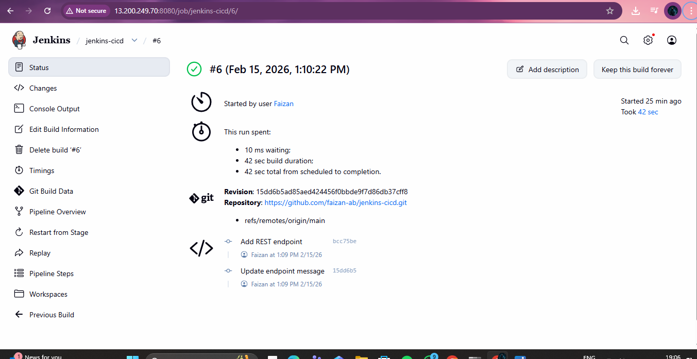
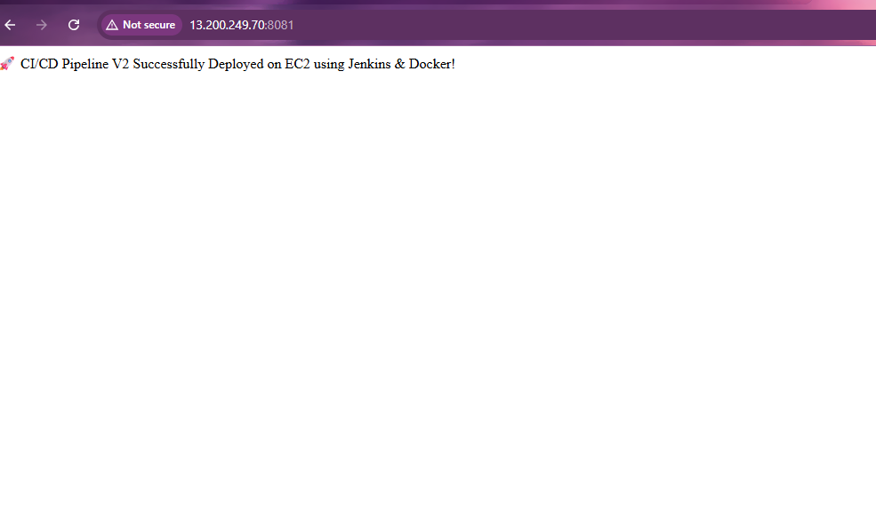

🚀 Jenkins CI/CD Pipeline with GitHub Webhook & Docker (AWS EC2 Deployment)
📌 Project Overview

This project demonstrates a complete end-to-end CI/CD pipeline built using:
GitHub (Source Control)
Jenkins (CI/CD Automation Server)
Maven (Build & Dependency Management)
Docker (Containerization)
DockerHub (Image Registry)
AWS EC2 (Deployment Environment)
GitHub Webhook (Auto Trigger)

The pipeline automatically builds, tests, dockerizes, pushes, and deploys a Spring Boot application whenever code is pushed to GitHub — with zero manual intervention.

🏗 Architecture
Developer Push → GitHub → Webhook → Jenkins Pipeline
        ↓
Maven Build → Unit Test → Package JAR
        ↓
Docker Build → Docker Push (DockerHub)
        ↓
Deploy Container on AWS EC2
        ↓
Live Application

⚙️ Tech Stack

Java 17
Spring Boot
Maven
Jenkins (Declarative Pipeline)
Docker
DockerHub
AWS EC2
GitHub Webhooks

🔄 CI/CD Pipeline Stages
1️⃣ Checkout
Clones source code from GitHub repository.

2️⃣ Build
Compiles the application using Maven.

3️⃣ Test
Executes unit tests to ensure code quality.

4️⃣ Package
Creates executable JAR file.

5️⃣ Docker Build
Builds a Docker image from the JAR.

6️⃣ Docker Push
Pushes image to DockerHub using secure credentials.

7️⃣ Deploy
Stops old container and deploys updated container on EC2.

🐳 Docker ConfigurationFROM eclipse-temurin:17-jre
WORKDIR /app
COPY target/*.jar app.jar
EXPOSE 8080
ENTRYPOINT ["java","-jar","app.jar"]

📜 Jenkinsfile (Declarative Pipeline)
The pipeline includes:
Tool configuration
Secure DockerHub credentials
Automated deployment
Workspace cleanup
Versioned Docker tagging using BUILD_NUMBER

## 📸 Project Screenshots

### ✅ Jenkins Pipeline Success

### 🌍 Live Application on EC2

🔐 Security & Best Practices Implemented
GitHub Webhook for automated triggering
DockerHub credentials stored securely in Jenkins
Versioned Docker images using build numbers
Workspace cleanup after each build
Separation of build and runtime environments

🎯 Key Learning Outcomes
Designing production-style CI/CD pipelines
Integrating GitHub with Jenkins using Webhooks
Automating Docker image build & deployment
Managing secure credentials in Jenkins
Deploying containerized apps on AWS EC2

👨‍💻 Author
Faizan
DevOps & Cloud Engineering Enthusiast
